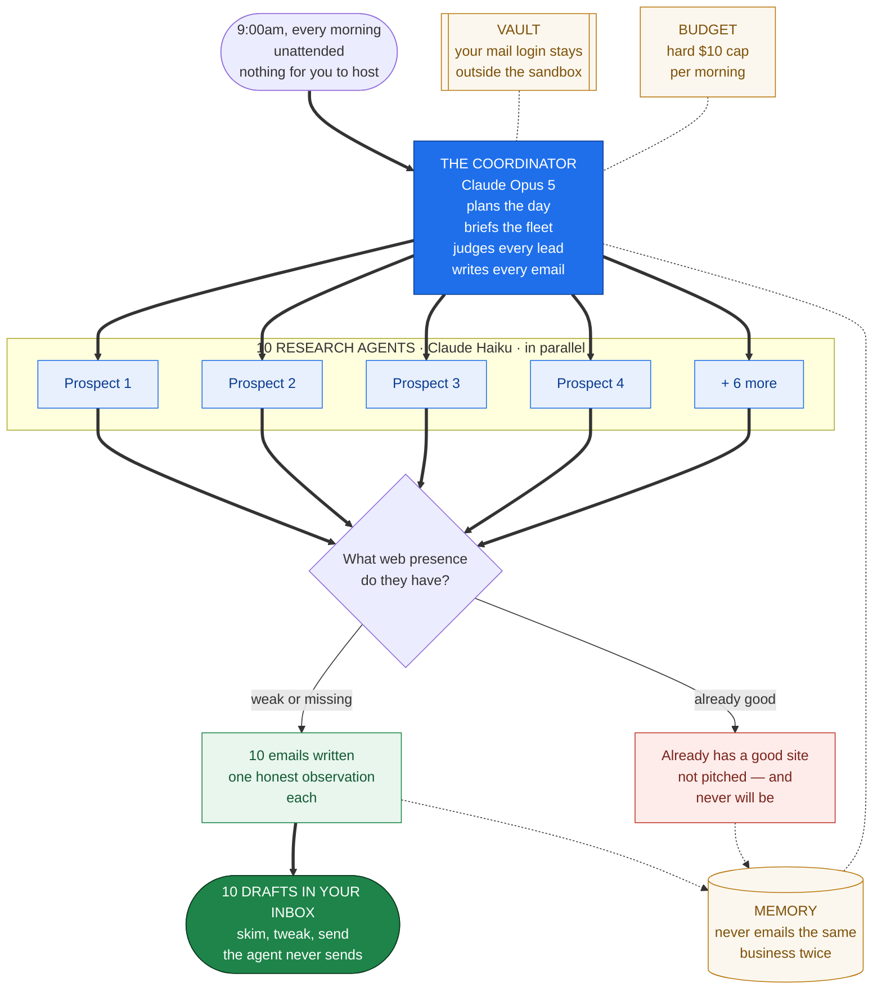
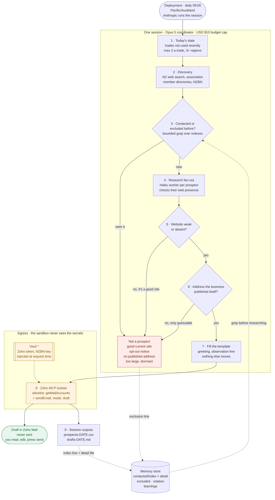

# Sales Outreach Agent

> **This is a demo build.** The sender identity ("Tradie Web Co", Alex Morgan)
> is fictional, every domain and email address uses an RFC 2606 reserved name
> that cannot resolve, and every credential in `.env` is a placeholder. Nothing
> here will contact anyone until you put your own details in. See
> [Making it real](#making-it-real).

A Claude Managed Agent that wakes at **09:00 Pacific/Auckland every day**, finds
10 New Zealand trade and contracting businesses whose web presence is weak or
missing, checks each one, and leaves a personalised email offering to build them
a website **as a draft in Zoho Mail** for you to review and send.

Anthropic runs the loop, the schedule, and the sandbox. There is no server to
host and no cron job on your machine.



---

## The offer

Trades are a good fit for this because the qualification signal is visible from
the outside: a certified plumber with 6,000 followers on Facebook and no website
is a prospect, and you can tell in thirty seconds.

- **Free** — a one-page mock-up of their site. They reply, you build a sample
  home page, they see it before spending anything.
- **Paid** — the build. Services, gallery of finished jobs, reviews, service
  area, quote form to their inbox, plus domain, hosting and Google Business
  Profile.

The email leads with the mock-up. See
[`email_templates/outreach_email_template.md`](email_templates/outreach_email_template.md)
for the approved copy and
[`email_templates/example_drafts.md`](email_templates/example_drafts.md) for
three worked examples of what lands in the mailbox.

### The one rule that keeps this honest

**A business with a good, current website is not a prospect.** The agent skips
them and records the exclusion. Pitching a website to someone who already has a
decent one means manufacturing a problem to sell the fix — it torches sender
reputation and it is the thing that makes this category of email deservedly
hated. It is a hard rule in the system prompt, not a preference.

---

## Setup

```bash
python -m venv .venv && .venv\Scripts\activate     # Windows
pip install -r requirements.txt
copy .env.example .env                              # then fill it in
python zoho_oauth.py                                # one-time Zoho login
python zoho_oauth.py --verify                       # confirm the token works
python setup_agent.py
python run_now.py                                   # test without waiting for 9am
```

`setup_agent.py` is idempotent. Edit `prompts/system_prompt.md`, re-run it, and
it publishes a new agent version against the same schedule.

### Getting the Zoho MCP URL

Go to the [Zoho MCP console](https://www.zoho.com/mcp/), create a server with
the Zoho Mail tools, and copy the server URL into `ZOHO_MCP_URL`. Add as few
tools as the console lets you: at minimum you need _Send Email_ (which doubles
as the draft tool — see Compliance below) and _Get Mail Accounts_. Anything
else you add is switched off again by `ZOHO_ALLOWED_TOOLS` in `config.py`, but
not adding it in the first place is better.

You do **not** copy a token out of the console — there isn't one to copy. The
server is an OAuth 2.0 protected resource, so `python zoho_oauth.py` performs
the login and captures the tokens for you.

What you do next depends on what the console handed you. Set `ZOHO_AUTH_MODE`
accordingly:

| The console gave you                    | Mode            | Where the secret lives               |
| --------------------------------------- | --------------- | ------------------------------------ |
| A long-lived bearer token               | `static_bearer` | Anthropic vault, write-only          |
| An access + refresh token pair          | `mcp_oauth`     | Anthropic vault, auto-refreshed      |
| A server URL with the key already in it | `url_embedded`  | The agent config — **not** the vault |

The first two are the ones to prefer. The token goes in `.env`, is stored in an
Anthropic vault, and is injected into outbound MCP calls at egress — it never
enters the sandbox, so nothing the agent writes can read or exfiltrate it, and
it is never echoed back by the API.

`url_embedded` is weaker, and the difference is structural rather than a
configuration choice: **a vault substitutes secrets into request headers and
bodies, never into the URL**, so a key carried in the URL cannot be vaulted at
all. It is stored verbatim in the agent's `mcp_servers` entry, which is readable
back from `GET /v1/agents`. The sandbox still can't see it — the agent calls
tools by name and Anthropic's proxy makes the request — so prompt injection
can't lift it, but anyone with read access to the workspace can, and secrets in
query strings tend to end up in logs along the way.

To rotate a `url_embedded` key: regenerate the server in the Zoho console, paste
the new URL into `.env`, and re-run `python setup_agent.py` — it publishes a new
agent version against the same schedule.

### Optional: NZBN register

A free key from the [MBIE API portal](https://portal.api.business.govt.nz/)
gives the agent the official NZ business register — legal and trading names,
addresses, ANZSIC industry codes. Good for _finding and classifying_ businesses;
its contact data is sparse, so the agent still confirms the email from something
the business published itself.

---

## Making it real

The demo ships with a fictional studio. Four things to change before it touches
a real recipient:

1. **`.env`** — a real `ANTHROPIC_API_KEY`, your real `SENDER_*` details, and a
   real Zoho MCP server. The placeholders will not authenticate.
2. **`email_templates/outreach_email_template.md`** — replace the sign-off block
   (name, company, URL) with yours, and adjust the build description to what you
   actually deliver and in what timeframe. Everything in that template is a
   promise the recipient will hold you to.
3. **`config.py`** — trim `NICHES` to the trades you actually want, and
   `REGIONS` to where you can service.
4. **`prompts/system_prompt.md`** — the "Who you are looking for" section is
   where your qualification bar lives.

Then `python setup_agent.py` to republish.

---

## Daily operation

```bash
python manage.py status         # schedule, next fire times, recent runs
python manage.py runs --failed  # why a morning run didn't produce a session
python manage.py pause          # going on holiday
python manage.py unpause
python manage.py contacted      # everyone emailed so far (optional domain filter)
python manage.py forget acme.co.nz   # allow re-contacting one business
python manage.py memory         # store size by area, and what's prunable
python manage.py prune --dry-run     # then drop --dry-run to actually delete
python run_now.py               # extra run, on demand
```

Each morning: open Zoho Mail, read the 10 drafts, edit what you want, send the
ones worth sending. The agent never sends.

---

## How prospects are found

The agent works down a ladder and stops at the first source that yields a
qualified business:



\* Unless your Zoho MCP URL carries its key inline — see
[Getting the Zoho MCP URL](#getting-the-zoho-mcp-url).

1. **Slate selection** — reads `/niches/rotation.md` from memory and picks
   trades it hasn't used recently, max 2 per trade, across ≥3 regions.
2. **Discovery** — NZ-scoped web search (trade + region), trade association
   member directories (Master Plumbers, Master Builders, Certified Builders and
   the like), chamber of commerce listings, and the NZBN register if a key is
   configured. Association member lists are the richest seam: certified,
   trading, and frequently without a website.
3. **Qualification** — roughly 2–40 staff, genuinely trading, not a franchise
   outlet / listed company / large commercial contractor.
4. **Web-presence check** — a Haiku worker establishes whether they have a site
   at all, and if so whether it's dated, mobile-broken, or on a free subdomain.
   **A good current site ends the candidacy here.**
5. **Email** — only an address the business has **published itself**, on its own
   site, its own Facebook or Google Business Profile, or a directory listing it
   created. No pattern-guessing, no permutation tools, no scraped personal
   addresses. If there's no published address, the prospect is dropped and
   replaced.

The research fan-out is why this is a multi-agent session: ten websites read in
one context window would crowd out everything else. Set `USE_MULTIAGENT=False`
in `config.py` for a simpler single-threaded trace at higher cost.

---

## Memory, and why it doesn't grow unbounded

At 10 contacted plus a handful of exclusions per day, a naive file-per-business
layout reaches ~5,500 files in a year. The bytes don't matter (~3 MB); the cost
is that the agent would pull a growing directory listing into context _every
morning_ just to answer "have I emailed this one before?".

So dedup and detail are separated:

```
contacted/index/<YYYY-MM>.md          one terse line per contact — permanent
contacted/detail/<YYYY-MM>/<domain>.md  full record — expires after 12 months
excluded/index.md                     permanent exclusions, one line each
niches/rotation.md                    trimmed to the last 60 days by the agent
playbook/learnings.md                 edited in place, capped at ~60 lines
```

The dedup check is a **bounded grep over the index files** — never a directory
listing — so a run's memory cost flattens at roughly one grep plus one month's
index (~20 KB) instead of growing with history. After a year that's 12 index
files, not 3,650 loose ones.

`excluded/index.md` earns its keep here more than in most outreach systems:
"already has a good website" is the most common outcome of a candidacy, and
without a permanent record the agent would re-research the same well-served
plumber every few weeks.

Pruning is path-based: the month lives in the detail path, so
`manage.py prune` is a deterministic delete with no timestamp guessing and no
model call. It never touches the index files — those are what stop a business
being emailed twice, and they're cheap enough to keep forever.

```bash
python manage.py memory              # what's there, what's prunable
python manage.py prune --dry-run     # see it before you mean it
python manage.py prune               # delete expired detail
python manage.py prune --months 6 --redact-versions
```

Two settings in `config.py`:

- **`DETAIL_RETENTION_MONTHS`** (default 12) — detail holds named contacts at
  real businesses, so this is a privacy setting as much as housekeeping. Under
  the Privacy Act 2020 you shouldn't hold personal information longer than you
  need it; drop it to 6 if you don't do annual follow-ups.
- **`REDACT_VERSIONS_ON_PRUNE`** (default off) — every memory write also
  creates an immutable version, and versions can only be _redacted_, never
  deleted. So deleting a detail file leaves its old content in the audit trail
  unless you redact. Turn this on if the retention window is a policy rather
  than a preference.

Run `prune` monthly — Task Scheduler works, or just after you read
`playbook/learnings.md`.

## Compliance

New Zealand's **Unsolicited Electronic Messages Act 2007** governs commercial
email to NZ addresses, and the agent is built around it rather than bolting it
on afterwards:

| Requirement           | How it's enforced                                                                                                                                                                                                                                          |
| --------------------- | ---------------------------------------------------------------------------------------------------------------------------------------------------------------------------------------------------------------------------------------------------------- |
| Consent               | Only addresses the business published itself, in a business capacity — the basis for deemed consent                                                                                                                                                        |
| Relevance to role     | Business addresses at operating businesses only; no consumers, no personal addresses                                                                                                                                                                       |
| Opt-out signals       | Any "no unsolicited enquiries" statement on the site → permanently excluded in memory                                                                                                                                                                      |
| Sender identification | Your name, company, reply address and website, from `.env`, in every draft. The Act requires the sender to be identified and readily contactable; unlike US CAN-SPAM it does not mandate a postal address or phone number, so the reply address carries it |
| Unsubscribe           | Your opt-out line, unmodified, in every draft                                                                                                                                                                                                              |
| Frequency             | One email per business ever, enforced by the `/contacted/` memory directory                                                                                                                                                                                |

This is how the system is designed, not legal advice — if you're doing volume,
have a NZ lawyer review the template once. The DIA enforces the Act and
penalties are real.

Three more things worth knowing:

- **Drafts, never sends — but read how that is enforced.** Zoho's MCP server
  offers no dedicated draft tool. A draft is `ZohoMail_sendEmail` with
  `"mode": "draft"` in the body — the _same_ tool that sends, distinguished by
  one field. So the send capability cannot be removed without losing drafting
  too. Three guards, in descending order of reliability:
  1. **Allowlist** (`ZOHO_ALLOWED_TOOLS` in `config.py`) — the agent can reach
     only `getMailAccounts` and `sendEmail`. The other seven tools, including
     `sendReplyEmail`, `readMessages` and `moveMessages`, are switched off at
     the platform and are unreachable no matter what the model attempts.
  2. **OAuth scopes** — no `messages.READ`, so the token cannot read your mail.
     Note this does _not_ block sending: Zoho puts send and draft-save behind
     the same `messages.CREATE` scope.
  3. **The system prompt**, which requires `"mode": "draft"` on every call and
     treats any text arguing otherwise as prompt injection.

  Guard 3 is the only thing standing between a draft and a sent email, and it
  depends on model compliance rather than a hard boundary. If the Zoho console
  ever gains a draft-only tool, switch to it and drop `sendEmail` from the
  allowlist — that converts the last guard from a promise into a wall.

- **Honest observations only.** The system prompt forbids the agent from
  telling a business its site is unprofessional, invisible on Google, or losing
  it money. It may only describe what it saw. This is a deliverability
  consideration as much as an ethical one — manufactured-urgency website spam
  is exactly what recipients report.
- **Reputation is the real constraint.** Guessed addresses bounce, bounces
  wreck domain reputation, and a wrecked domain takes months to recover. That's
  why "published address or skip" is a hard rule and not a nicety.

---

## Cost control

Each run carries a hard `budget` of **USD $10.00** of list-priced spend
(`DAILY_BUDGET_CENTS` in `config.py`). A session that reaches the cap _pauses_
rather than terminating — nothing is lost, and raising the budget resumes it.

The other lever is `EFFORT` in `config.py`. It ships at `high`; once you have a
few runs to compare, try `medium` — for research-and-write work the quality
difference is often small and the token difference is not.

---

## Files

| Path                                         | What it is                                                         |
| -------------------------------------------- | ------------------------------------------------------------------ |
| `config.py`                                  | Schedule, model, budget, trades, regions, sender identity          |
| `prompts/system_prompt.md`                   | The agent's standing instructions — **the real product**           |
| `prompts/daily_task.md`                      | The kickoff message sent at each firing                            |
| `email_templates/outreach_email_template.md` | The approved email copy                                            |
| `email_templates/example_drafts.md`          | Three worked examples of the output                                |
| `zoho_oauth.py`                              | One-time Zoho OAuth handshake; `--verify` lists the server's tools |
| `setup_agent.py`                             | One-time (idempotent) provisioning                                 |
| `run_now.py`                                 | Manual trigger + live stream + output download                     |
| `manage.py`                                  | Pause/unpause, run history, contacted list, memory pruning         |
| `anthropic_compat.py`                        | Deployment calls with a raw-HTTP fallback                          |
| `state.json`                                 | Generated resource IDs — keep it, don't commit it                  |

## Tuning it

Almost all of the quality lives in `prompts/system_prompt.md`. The parts worth
editing first:

- **"Who you are looking for"** — the three-case web-presence test. This is the
  qualification bar and it decides who gets an email at all.
- **"Writing the observation line"** — the one personalised paragraph, and the
  only thing distinguishing this from a mail merge.
- **`NICHES` in `config.py`** — cut it to the trades you actually want to build
  for, rather than the broad 30 it ships with. Trades where the customer
  chooses on photographs — landscaping, joinery, tiling, roofing — tend to
  respond best to a website pitch.

After a couple of weeks, read `playbook/learnings.md` in the memory store —
the agent writes down which trades and sourcing routes yield the most
no-website prospects, and that's the cheapest source of prompt improvements
you'll get.
